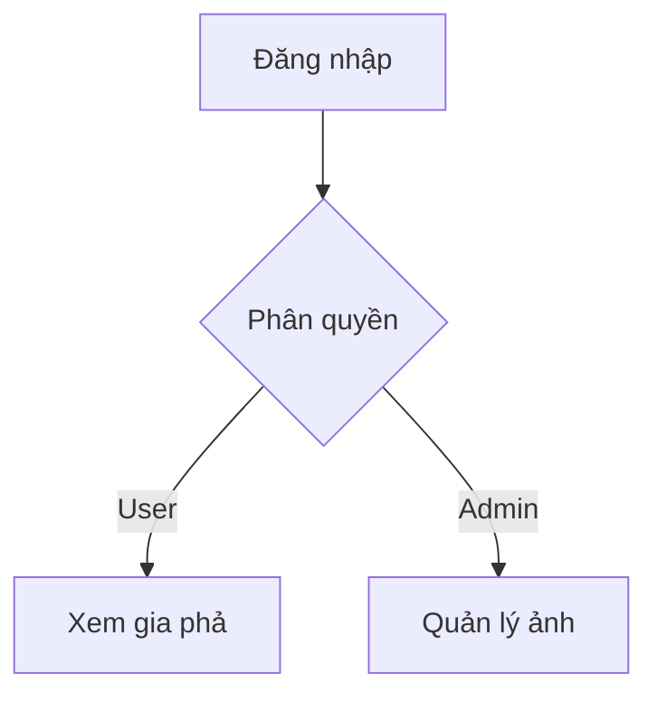
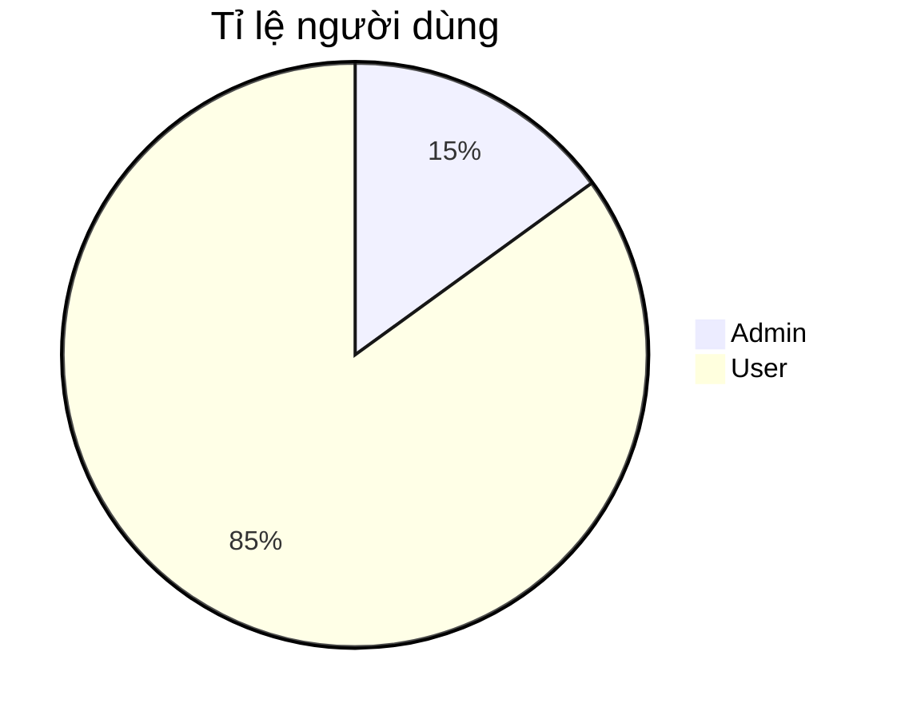

# 🏡 Website Gia phả

 


## 🌟 Giới thiệu
Hệ thống quản lý gia phả trực tuyến với các tính năng:
- Tìm kiếm thông minh thành viên
- Hiển thị quan hệ gia đình dạng cây
- Hỗ trợ đa ngôn ngữ (Việt/Anh)

## 🛠 Tính năng nổi bật

### 🔍 Tìm kiếm tiên tiến
| Tính năng               | Mô tả                                                                 |
|-------------------------|----------------------------------------------------------------------|
| Real-time search        | Hiển thị kết quả ngay khi nhập ≥2 ký tự                              |
| Highlight kết quả       | Đánh dấu từ khóa trùng khớp trong tên/ID                             |
| Đa tiêu chí             | Tìm theo tên, ID, năm sinh (VD: "Nguyen Van A" hoặc "1990")          |

### 🌳 Quản lý dữ liệu
```json
// Ví dụ dữ liệu thành viên
{
  "person_id": "G001",
  "person_name": "Trần Văn B",
  "person_birthday": "15/08/1975",
  "relations": ["G002", "G003"]
}

📊 Kiến trúc hệ thống

graph TD
    A[Trang chủ] --> B(Tìm kiếm)
    A --> C(Cây gia đình)
    B --> D[Kết quả highlight]
    C --> E[Visualization D3.js]

🚀 Cài đặt

📊 Kiến trúc hệ thống
mermaid
Copy
graph TD
    A[Trang chủ] --> B(Tìm kiếm)
    A --> C(Cây gia đình)
    B --> D[Kết quả highlight]
    C --> E[Visualization D3.js]
🚀 Cài đặt
Clone repo:

bash
Copy
git clone https://github.com/your-repo/gia-pha.git
Chỉnh sửa person_list.json

Khởi chạy:

bash
Copy
python -m http.server 8000
📌 Yêu cầu hệ thống
Trình duyệt hỗ trợ ES6+

Dung lượng tối thiểu: 50MB cho 1000 thành viên

📜 Lịch sử phiên bản
Version	Ngày	Thay đổi quan trọng
1.2	2023-11-20	Thêm highlight và thông báo "Không tìm thấy"
1.1	2023-10-15	Tối ưu hiệu suất tìm kiếm
🤝 Đóng góp
Gửi Pull Request hoặc báo lỗi tại Issues

## 🚧 Roadmap & Tính năng tương lai

### 🔐 Hệ thống đăng nhập
```json
// Cấu trúc dự kiến cho users.json
{
  "users": [
    {
      "username": "admin",
      "password": "simple123", // Password đơn giản (không yêu cầu phức tạp)
      "role": "admin"
    },
    {
      "username": "user1",
      "password": "user123",
      "role": "user"
    }
  ]
}



# Test Mermaid

